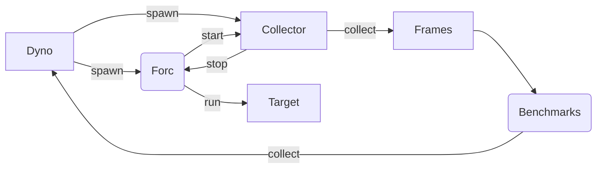

# Design

The Dyno performs the following steps:

- Spawns the Forc compiler with the appropriate arguments.

- Spawns the collector.

- The compiler indicates to the collector that it is starting.

- The collector starts collecting data and timestamps for the compiler passes.

- The compiler indicates to the collector that it is stopping.

- The collector constructs the data to be returned as output.

Dyno collects the following data:

- Complete system specifications (CPU, RAM, etc.).

- The time taken by each compiler pass.

- The time taken by the entire compilation process.

- ASM information

- Bytecode Size

- Data Section Information

- Entries Information

- Program Information
