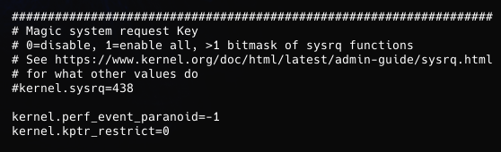
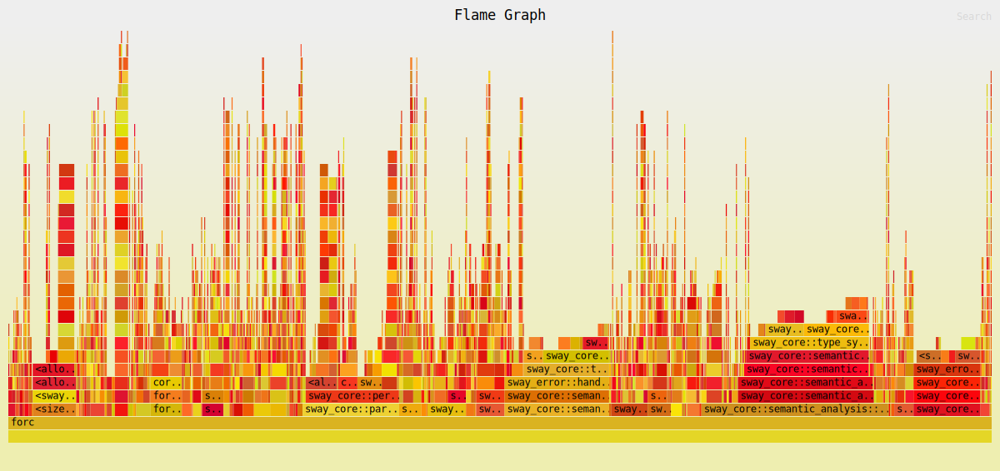
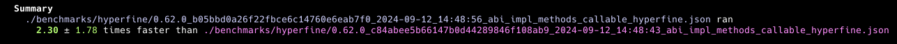

# Dyno A Fuel Orchestrator for Performance Profiling & Benchmarking


- [Dyno A Fuel Orchestrator for Performance Profiling \& Benchmarking](#dyno-a-fuel-orchestrator-for-performance-profiling--benchmarking)
  - [Introduction](#introduction)
  - [Requirements](#requirements)
  - [Installation](#installation)
  - [Usage](#usage)
    - [Target](#target)
    - [Forc Path](#forc-path)
    - [Output Folder](#output-folder)
    - [Print Output](#print-output)
    - [Flamegraph Support](#flamegraph-support)
    - [Data Only](#data-only)
    - [Hyperfine Support](#hyperfine-support)
    - [Database Support](#database-support)
  - [CI/CD Mode](#cicd-mode)

## Introduction

The `dyno` application is a performance profiling and benchmarking tool for [Fuel Orchestrator](https://fuellabs.github.io/sway/master/book/forc/index.html) (forc).

It is designed to ensure that areas of the Fuel codebase are not regressing in performance, and can provide insight into the specifics of code performance. The tool is primarily designed to be used in a CI/CD pipeline, but can also be run in a headless state on a local machine.

The tool manages dispatching of `forc` and measures performance frames at a fixed interval. Each frame is comprised of common hardware resource usage consumed by the running `forc` executable at the time the frame was captured. The tool also takes cues from `forc` to include extra information in the benchmarking frames (i.e: when certain compilation phases begin and end, generated binary information, etc), allowing for a more narrow and granular degree of inspection.

The tool can optionally use [perf](https://en.wikipedia.org/wiki/Perf_(Linux)) or `sample` (Mac) for stats, [inferno](https://github.com/jonhoo/inferno) for flame graphs and [hyperfine](https://github.com/sharkdp/hyperfine) for additional sanity checks.

## Requirements

> [!IMPORTANT]
>
> The profiler requires the following:
>
> - Rust Language
> - Sway Language
> - Sway Compiler build with `--features profiler`
> - Linux for `flamegraph` support using `perf` (Optional)
> - Hyperfine (Optional)
> - `Postgres` for database support (Optional)
>
> In order for `perf` (used for flamegraph) to work properly on linux, the following options must be set in `/etc/sysctl.conf`:
>
> 
>

```bash
echo "kernel.perf_event_paranoid=-1" | sudo tee -a /etc/sysctl.conf
echo "kernel.kptr_restrict=0" | sudo tee -a /etc/sysctl.conf
sudo sysctl -p /etc/sysctl.conf
```

## Installation

- [Install Rust](https://www.rust-lang.org/tools/install)
- [Instal Sway](https://fuellabs.github.io/sway/v0.19.0/introduction/installation.html)
- [Install Hyperfine](https://github.com/sharkdp/hyperfine)(Optional)
- [Install Docker](https://docs.docker.com/engine/install/)(Optional)
- [Install Postgres](https://hub.docker.com/_/postgres)(Optional)

Git clone the sway repository and build it with the `--features profiler` flag.

```bash
git clone https://github.com/FuelLabs/sway
cd sway
cargo build --release --features profiler
```

Git clone the dyno repository.

```bash
git clone https://github.com/ourovoros-io/dyno.git
cd dyno
```

Run the tool by point to the `forc` binary build with the `--features profiler` flag and a target folder.

```bash
cargo r --release -- -t <target_folder> -f <forc_profile_binary>
```

> [!TIP]
>
> Installation script for database use at [test_data/test_with_docker_setup.sh](./test_data/test_with_docker_setup.sh).

## Usage

```bash
====================================================================================================
                         Welcome to the Fuel Dyno v0.1.0
====================================================================================================
Fuel Orchestrator Performance Profiling & Benchmarking

Usage: dyno [OPTIONS] --target <TARGET> --forc-path <FORC_PATH>

Options:
  -t, --target <TARGET>
          A path to a target folder or file to compile
  -f, --forc-path <FORC_PATH>
          The path to the forc binary compiled with --features profiler
  -o, --output-folder <OUTPUT_FOLDER>
          [default: ./benchmarks]
  -p, --print-output
          Enable printing output (Optional)
      --flamegraph
          Flamegraph support (Optional)
      --data-only
          Only data for flamegraph (Optional)
      --hyperfine
          Enable hyperfine analysis (Optional)
      --max-iterations <MAX_ITERATIONS>
          Maximum iterations for hyperfine (Optional) [default: 2]
  -d, --database
          Database support (Optional)
  -h, --help
          Print help
  -V, --version
          Print version
```

---

### Target

The `target` folder of items or item to be compiled by the `Sway compiler` and profiled by `dyno`.

---

### Forc Path

`Forc-path` option allows the usage of a `specific version` of the `compiler` that is compiled with the `--features profiler` flag.

> [!IMPORTANT]
>
> The tool `requires` that sway is compiled with `--features profiler` flag that allow the profiler to collect data.

---

### Output Folder

Set the output folder for the `benchmarks` data as `json`.

By default the profiler will store the benchmarks under `./benchmarks`.

The format of the filenames is `forc_version_md5hash_of_forc_date_time.json`.

---

### Print Output

Prints the output of the run in the terminal.

---

### Flamegraph Support

> [!TIP]
>
> To get the most detailed output from the flamegraph in release mode we need to enable debug.

```toml
[profile.release]
debug = true
```

Example output



---

### Data Only

Data only mode disables the creation of svg files from the data collected for flamegraphs creation.
This allows the output of the tool to be more light in performance/disk usage and leaves the creation of svg in the hands of `dynosite` or any other tool.

---

### Hyperfine Support

Enables `hyperfine` feature.




---

### Database Support

[test_with_docker_setup](/test_with_docker_setup.sh)

---

## CI/CD Mode

Please follow the instruction in the `DynoSite` README.md.

[DynoSite README.md](https://github.com/ourovoros-io/dynosite/blob/main/README.md)
